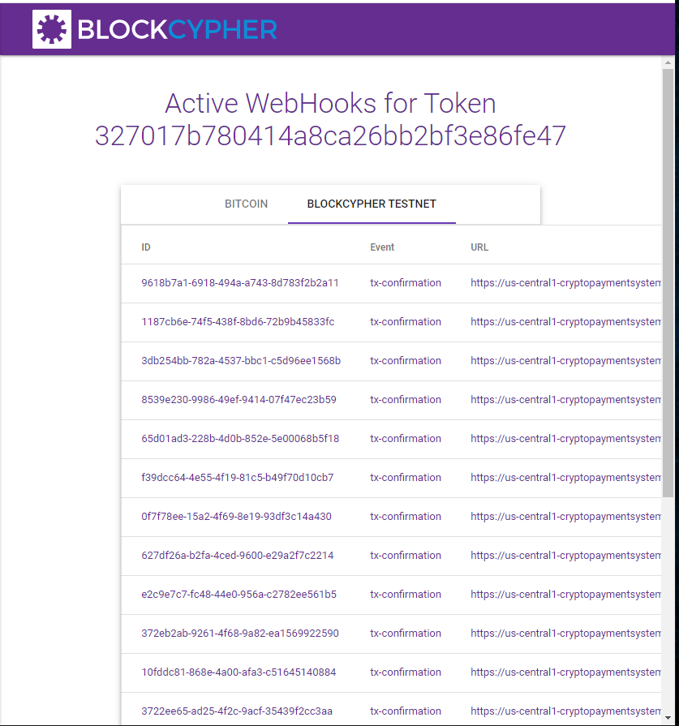
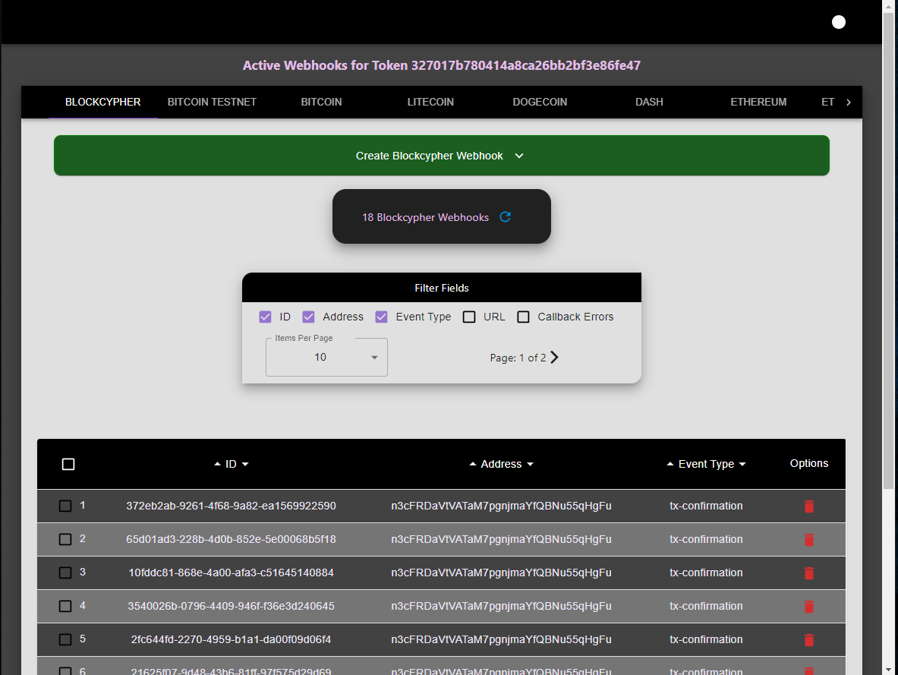
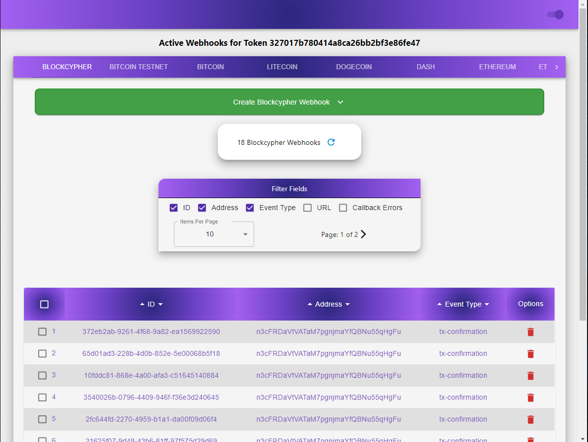
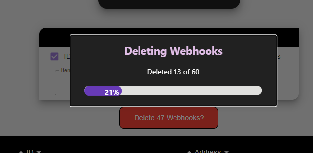
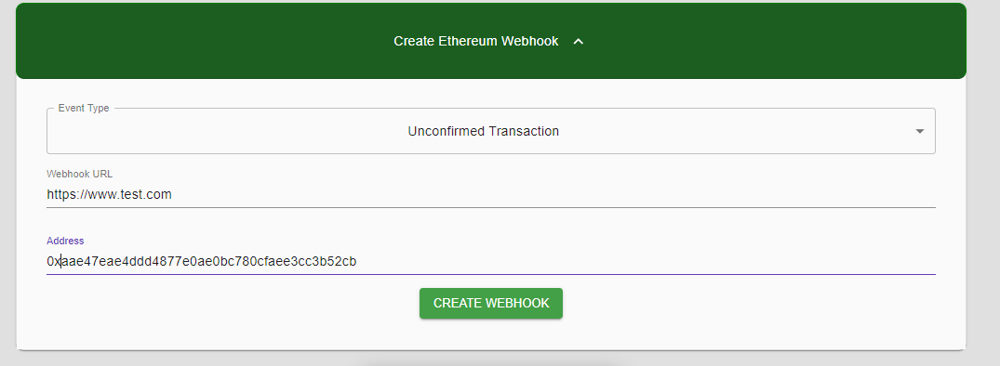

  <h1 align=center><a href="https://blockcypher-webhooks-ui.netlify.app/"> Better BlockCypher Webhook UI</a></h1>
     
    

    Created with <a href="https://reactjs.org/">React</a> and <a href="https://material-ui.com/">Material-UI</a> styles
    

  

  
<h2 style="display: inline-block">Table of Contents</h2>

  <ol>
    <li>
      <a href="#about">About</a>
    </li>
    <li><a href="#features">Features</a></li>
    <li><a href="#install">Installing</a></li>
  </ol>

## About

The current BlockCypher UI, pictured below, looks like it was never completed.

There's broken stylings on the table body which overflows for small browser widths, and there's no scroll functionality, so the viewport must be large enough to view all the content.

In addition, it currently only support 2 coins, the Blockcypher testnet coin and Bitcoin mainnet.

I've primarily used the command prompt to make API requests to view my webhooks, but for large number of webhooks, it is nice to be able to see them all visually.

So I decided to make a better UI that has the basic functionality that I or anyone else would need.

## Features

### Dark/Light Theme

> Change the theme between Light and Dark Mode by clicking the toggle switch in the upper right hand corner

;&nbsp;&nbsp;

### Larger Coin Selection

> Webhook data can be retrieved for Bitcoin, BlockCypher Testnet, Bitcoin Testnet, Litecoin, DogeCoin, Dash, Ethereum, and BlockCypher Ethereum Testnet

### Delete Webhook

> Delete individual webhooks by clicking the trash can button to right in the table

### Batch Delete Webhooks

> Multiple webhooks can be deleting at once by clicking the select box to the left of the webhook in the table. Clicking the Delete All Webhooks button will delete them within the calculated rate limits of the API

### Create New Webhook

> Add new webhooks associated with your token by clicking the Create Webhook tab.

> Note that some event types have additional optional fields that cannot be added with this current UI.

> The API for blockcypher appears to only check the checksum of an address to see if it was created with SHA256. It does not check the prefixes to differentiate between each coin.

> I've added the same checksum test on the front end and also checked against common prefixes. A problem with checking the prefixes is that new address types such as Bech32 cannot be checked the same way and will be invalidated. I've added an option for the user to override the validation and submit a webhook anyways.

> I've removed the validation logic from Ethereum since it will always return false since Ethereum uses a different hash algorithium to create their addresses.

### Filter Headers

> Filter which fields are shown as table headers by selecting/deselecting them in the Filter Fields box based on the field

### Sort By Header

> The Table Headers can be clicked so that the webhooks are sorted in ascending or descending order

### Address Field

> The address field is shown for applicable event types when creating a new webhook. If it is clicked it will redirect to the BlockCypher block explorer for that address and coin. These all work with the exception of Blockcypher's Ethereum testnet.

### Select Items Per Page and Paginate

> Select how many webhooks should appear on the table at once, and the data will be rerendered in pages.

## Install

    cmd

    git clone https://github.com/GalaxysHub/better-blockcypher-webhook-ui.git

    cd github.com/GalaxysHub/better-blockcypher-webhook-ui.git

    npm i

Replace the TOKEN variable in the src/config/blockcypher.js file with your BlockCypher token. If a token is not used, mock data will be imported.
You can use the token below if you want to hit the API and see live data quickly, but it is tied to my free account and rate limited at the lowest tier.

    const TOKEN = "327017b780414a8ca26bb2bf3e86fe47";

Then cmd

     npm run start

## Deployed Version

https://blockcypher-webhooks-ui.netlify.app/
